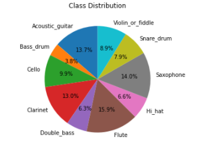
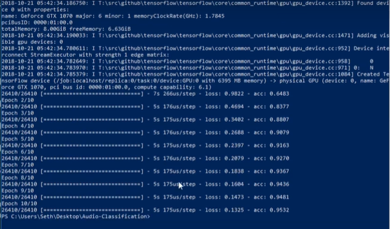

# Audio-Signal-Processing-using-Deep-Learning
This repository includes an entire workflow for Audio Classification using Deep Learning.

## Requirements
* Python
* Pandas
* Librosa
* python_speech_features

## Problem Statement
The task is to build an automatic audio tagging system using a dataset of audio files consisting of 10 different types of musical instruments, i.e. Acoustic_guitar, Bass_drum, Cello, Clarinet, Double bass, Flute, Hi_hat, Saxophone, Snare_drum, Violin_or_fiddle. The main goal for the system is to be able to recognize an increased number of sound events of diverse nature.

## Dataset

### Class Distribution

### Validation Result

